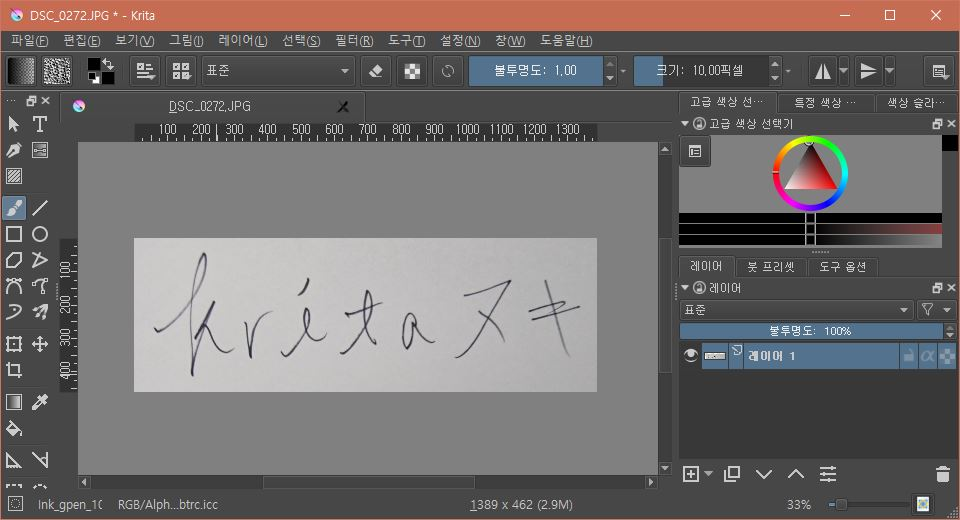
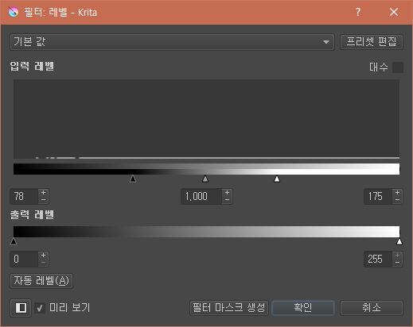
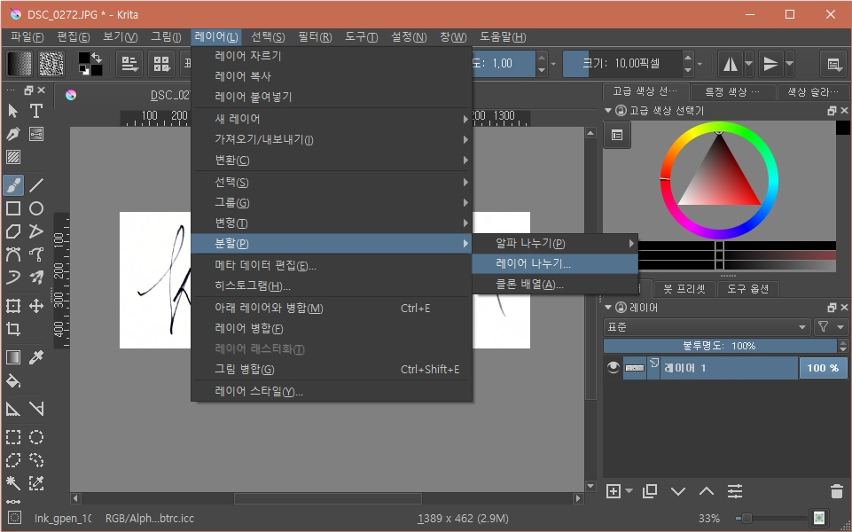
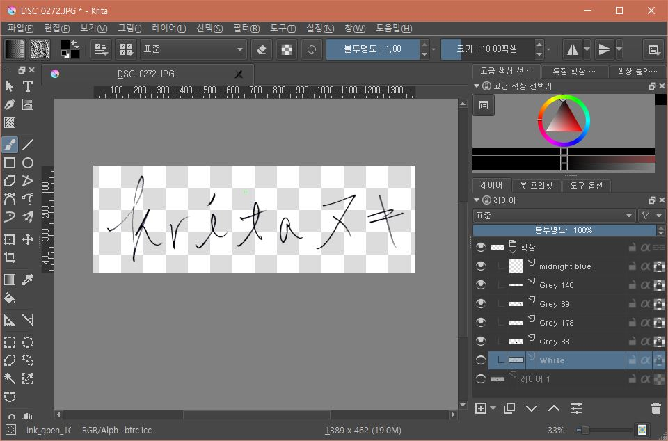
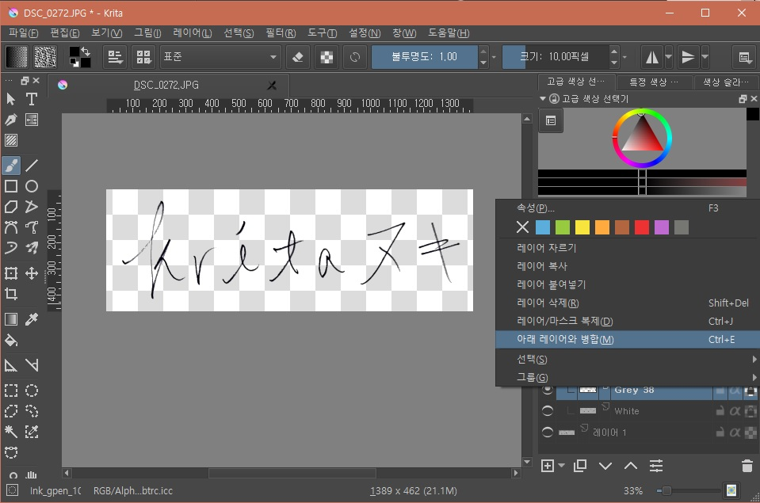
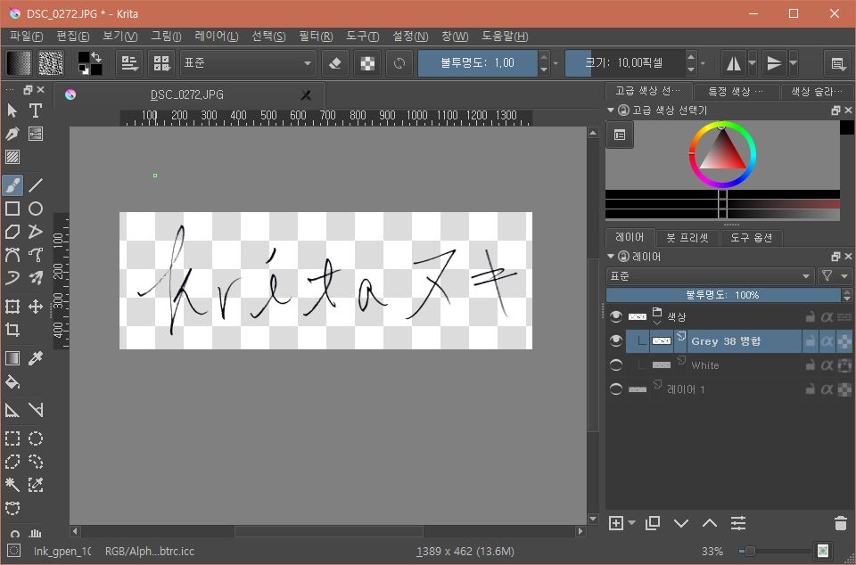

[Krita](https://krita.org)는 오픈소스 페인팅 프로그램입니다.
오픈켄버스, 포토샵, 페인터와 유사한 기능을 가지고 있습니다.
하지만 무료입니다.
이 프로그램으로 선 따기를 해보겠습니다.

## 그림 정리하기

먼저 선을 딸 그림을 스캔한 이미지를 준비합니다.
그림그리기는 귀찮아서 글씨를 사용했습니다.

### 레벨 조정하기

선 좀 따보신 분은 알겠지만, 선을 따기 전에는 반드시 레벨을 조정해야 합니다.
그림일 경우는 지저분한 선을 정리하기 위해서입니다.
제가 사용한 이미지는 폰으로 찍은 그림인데, 오른쪽에 그림자가 졌습니다.

[필터] - [조정] - [레벨]을 차례대로 선택합니다.

적당히 레벨을 조정합니다.

이제 선 좀 딸만한 그림이 준비되었습니다.

## 선 따기

저는 지금까지 포토샵으로만 선을 땄으므로 포토샵과 비교해서 설명드리겠습니다.
포토샵은 채널을 나눠서 검정색만 선택합니다.
크리타도 비슷한데, 더 직관적입니다.
크리타는 색깔별로 레이어를 나눕니다.

### 레이어 나누기

[레이어] - [분할] - [레이어 나누기]를 차례대로 선택합니다.

뭐 다른거 안하고 바로 'Apply' 버튼을 클릭합니다.
그러면 아래처럼 **색깔별로 레이어가 나눠집니다.**

'midnight Blue'부터 'White'까지 색깔별로 레이어가 나눠졌습니다.
앞으로 작업을 위해 `레이어 1`은 표시를 해제했습니다.

### 사용할 레이어 분류

레이어 나누기로 나눠진 레이어의 이름은 해당 레이어의 색깔을 의미합니다.
'White' 레이어는 흰색입니다.
여기서는 검은색 글씨만 사용하므로 'White'레이어를 비표시합니다.
만약 레벨 조정이 어려워서 자잘한 선이 남아있다면 다른 레이어를 비표시해보면서 필요한 레이어를 찾습니다.

나눠진 'Gray' 레이어는 숫자가 붙는데, **낮을수록 검은색** 에 가깝고 **높을수록 하얀색** 에 가깝습니다.
따라서 숫자가 높은 순서대로 비표시해보면서 맘에 드는 레이어만 표시합니다.
여기서는 'Gray 140'이나 'Gray 178'가 그 대상이 될 수 있는데, 생각보다 잘 안보여서 이 레이어들까지 포함했습니다.

### 사용할 레이어 병합

필요한 레이어를 모두 찾았으니 `ctrl`을 누른 상태로 표시 상태의 레이어를 마우스로 클릭하여 선택합니다.
그리고 [우클릭] - [아래 레이어와 병합] 혹은 `ctrl + E`를 눌러서 레이어를 병합합니다.

이제 선만 선택된 레이어가 생성되었습니다.
현재는 해당 레이어가 종속 레이어 상태입니다.
종속 레이어라도 다른 레이어로 드래그하면 바로 일반적인 레이어가 됩니다.
혹은 이 상태에서 레이어를 `ctrl + C`를 눌러서 복사한 후 새 문서를 만들어서 붙여넣어도 됩니다.

> 새 문서를 만들어서 레이어를 붙여 넣을 경우 프로파일이 누락되었다는 경고가 발생할 수 있습니다.
웹 프로파일이던 모니터던 아직까진 큰 차이 없으므로 그냥 붙여넣으시기 바랍니다.
만약 올바르게 복사되지 않는다면 다른 이름으로 저장한 후 나머지 레이어를 삭재하여 사용할 수 있습니다.
