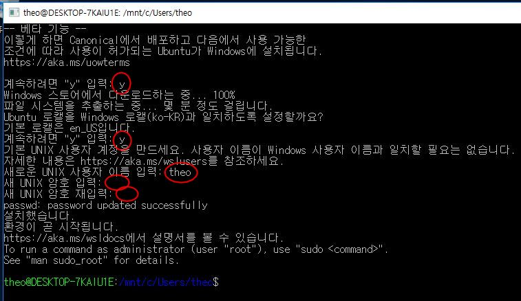
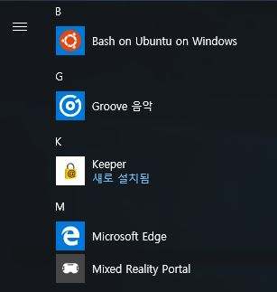
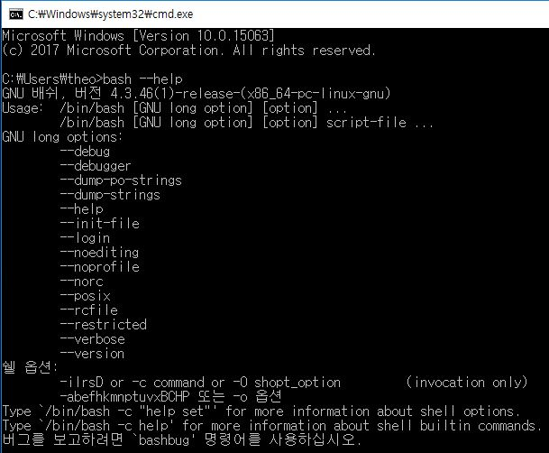
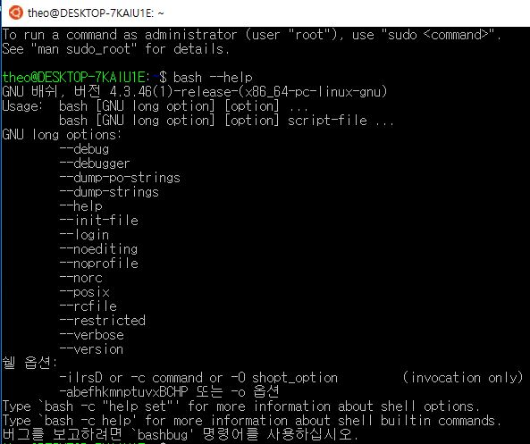
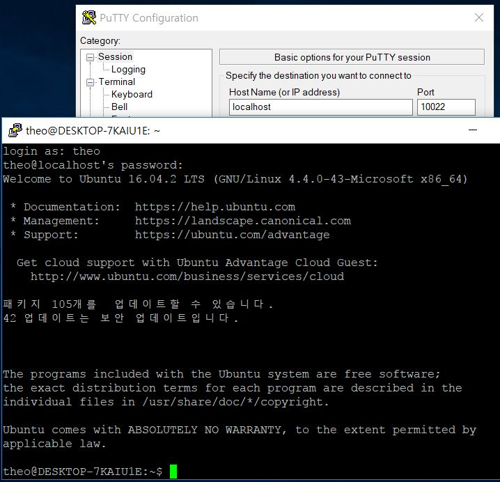

## bash-on-windows 설치

### 개발자용 모드 활성화하기

먼저 windows 설정으로 들어가서 **업데이트 및 복구** 메뉴로 이동합니다.


여기서 **개발자용** 탭을 선택한 후 **개발자 모드** 를 선택합니다.


이 말은 '선생님은 컴퓨터를 박살낼 수 있는 권한까지 획득할 수 있습니다'를 의미합니다. 바이러스도 이정도 권한은 그냥 가지고 다닙니다. 우리도 그 정도의 권한은 있어야겠죠? **'예'** 를 선택합니다.


설치를 성공하면 다음처럼 설치되었다는 안내가 나옵니다.


### WSL 기능 켜기

WSL(Windows Subsystem for Linux, 한글명 'Linux용 Windows 하위 시스템')은 윈도우에서 제공하는 기능이나 평소에는 실행할 수 없습니다. **제어판** 의 **프로그램 및 기능** 에서 **Windows 기능 켜기/끄기** 로 들어가야 키고 끌 수 습니다.


선택하고 '확인'을 누르면 곧 설치가 완료됩니다. 그리 오래걸리진 않습니다. 바로 재부팅합니다.

### Bash-on-Windows 설치

재부팅이 끝나면 bash를 실행해보겠습니다. 먼저 `win+x`를 누르거나 '시작'메뉴에 커서를 대고 우클릭해서 '명령 프롬프트', 또는 '시작'-'Windows 프로그램'-'명령 프롬프트'를 실행합니다. 다 명령 프롬프트를 실행하는 방법입니다.

 그리고 아래와 같이 `bash`라고 입력합니다.


설치 과정에서 총 5번의 질문을 받습니다. 아래의 빨간 동그라미가 그 입력 위치입니다.



각 질문은 다음을 의미합니다.

1. Ubuntu-on-Windows를 설치할 것인가?
    > 반드시 **y**

1. locale을 윈도우와 동일하게 할 것인가?
    > 정말 영어에 자신이 없지 않은 이상 **y**

1. ubuntu 사용자 계정명
    > 사용하고자 하는 계정명

1. 사용자 계정 비밀번호
    > 짧아도 상관 없으므로 편하게 입력하시기 바랍니다.

1. 사용자 계정 비밀번호 확인
    > 직전에 입력한 비밀번호와 동일해야 합니다.

여기까지 끝낸다면 설치는 완료입니다.
마지막으로 `sudo apt -y upgrade` 와 `sudo apt-get -y upgrade`를 입력하여 시스템을 최신상태로 업데이트합니다.

이제는 명령 프롬프트창에서 `bash`를 입력하면 WSL의 bash로 접속하실 수 있습니다. 또한 '시작'에서도 bash for windows 를 확인할 수 있습니다.



### 주의점

이제 윈도우에서도 `bash` 명령어를 통해 Shell script를 실행할 수 있습니다.
또한 _PoserShell_ 처럼 윈도우 상에서 리눅스 명령어를 실행하는 방식이 아니라 _ubuntu_ 에서 실행되므로 완벽하게 작동합니다...**만**,
반드시 `bash`명령어를 써야 하고, 다른 프로그램들이 기본적으로 지원은 커녕 이걸 이용해서 사용하는 방법도 지원 안하는 경우가 대부분이므로
*ubuntu* 환경에서 구동시켜야하는 서버나 테스트 프로그램 정도나 실행해볼만 합니다.

또한 마지막 bash 창이 꺼질 때 WSL도 함께 종료되므로 주의하시기 바랍니다.

## Windows에서 `bash`로 *Shell script* 실행

당연한 얘기지만, 윈도우 프로그램으로 `bash`가 있기 때문에 윈도우 명령 프롬프트 창에서 `bash`를 입력할 수 있습니다. 이 `bash`는 여타 Linux의 `bash`와 (거의) 완벽하게 동일합니다.




따라서 Shell script를 리눅스에서 하듯이 실행하면 됩니다.

다음은 그 예제입니다.

### `bash`로 `echo hello world` 출력하기

`bash` 옵션인 `-c` 는 문자열을 명령어로 실행하는 옵션입니다. 이 옵션을 이용해 hello world를 출력해보겠습니다.


### 명령 프롬프트 창에서 `test.sh`을 생성하고 그 내용을 bash로 출력하기

이번에는 윈도우 명령어와 섞어보았습니다. 한 줄씩 살펴보겠습니다.


1. `echo echo hello world > test.sh`
    - `echo hello world`를 'test.sh'로 출력합니다. 이 때 `>`명령어는 '매개변수의 문자열을 파일명으로 가지는 파일을 만들어서, 있으면 삭제하고 만들어서 문자열을 저장한다'입니다.
1. `more test.sh`
    - `bash`의 `tail` 명령어와 유사합니다. 파일 내의 문자열을 출력합니다.
1. `bash -c ./test.sh`
    - 'test.sh'을 bash로 실행합니다. -c는 문자열을 실행시키는 명렁어지만, 파일경로가 입력되면 그 파일에 기록된 명령어를 실행합니다.

## WSL에 ssh 접속

ubuntu on Windows에 ssh로 접속해보겠습니다. `bash -c`를 이용해 명령 프롬프트에서 실행할 수 있다고는 하지만, 대부분의 윈도우 프로그램이 이를 지원하지 않습니다. 하지만 다른 리눅스 시스템처럼 ssh를 이용해 상호 통신하여 다양한 기능을 수행할 수 있습니다. eclipse의 remote tomcat server라던가, IntelliJ의 remote server처럼 말이죠.

### `ssh-server` 삭제 및 재설치

버전 문제인지, 처음에 잘못 설치해서 그런지는 몰라도 있던 `ssh-server`로는 접속이 안 됩니다. 따라서 삭제 후 재설치합니다.

```
sudo apt-get remove openssh-server
sudo apt-get install openssh-server
```

필요한 만큼 설정해주시되, 포트는 변경해야 합니다. 저는 10022로 변경하였습니다.

#### /etc/ssh/sshd_config

```
Port 10022
AllowUsers theo
...
```

그리고 ssh server를 재시작합니다.

```
sudo service ssh --full-restart
```

이제 ssh를 접속해도 되지만, 제대로 실행되었는 지를 확인하기 위해서 윈도우에도 포트가 제대로 열렸는 지 명령 프롬프트에서 `netstat` 명령어로 확인해보겠습니다.

#### 명령 프롬프트: netstat


제 윈도우의 호스트네임이 Theodore라서 Theodore:10022로 매핑되어 있다고 출력됩니다. 보시면 선택한 포트인 10022 외에도 6321, 6322가 보이는데, 이는 윈도우에서 WSL과 통신하기 위해서 매핑하는 포트이며 접근은 불가능합니다. 이 매핑이 있어야 올바르게 작동합니다. 참고로 두 개가 있을 수도 있고 한 개만 매핑될 수도 있습니다.

마지막으로 'putty'로 접속한 화면입니다.



## References

- [superuser: how can i ssh into bash on ubuntu on windows 10?](https://superuser.com/a/1114162)
- [stackoverflow: What does bash c do?](https://stackoverflow.com/a/20858414)
- [stackonverflow: How to display text file content in cmd?](https://stackoverflow.com/questions/17217476/how-to-display-text-file-content-in-cmd)
